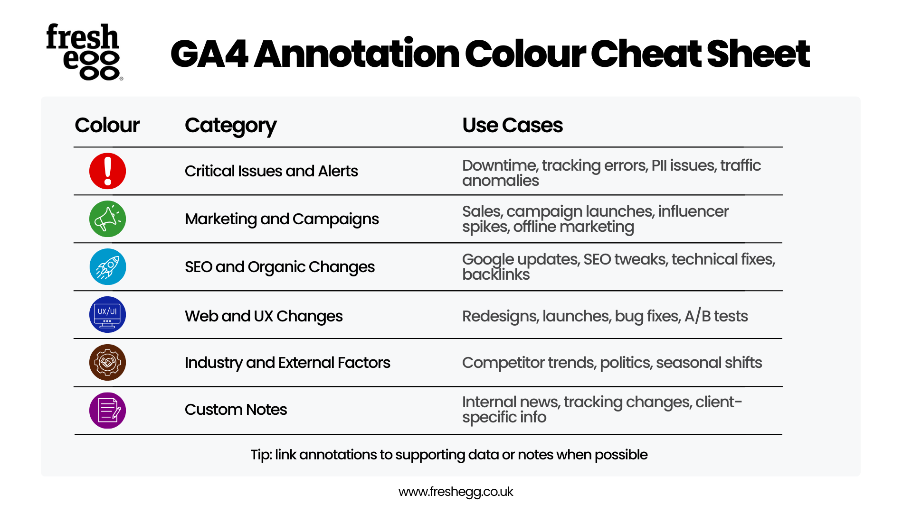

# What are Annotations and How can you Automate them in GA4?

## What are GA4 Annotations
GA4 annotations are like notes that you can add directly within the interface to provide context about a certain scenario like campaign launches, website issues, server outages etc. 

They are helpful, as they reduce the wasted effort and keeps everybody updated.

It's like labelling your sandwich so that nobody else eats it.

An article by Alex Pereira from Fresh Egg ([1]) gives a great example of how to leverage the color coding options to make annontations a powerhouse.

## References

[1](https://www.freshegg.co.uk/blog/ga4-annotations-in-2025-everything-you-need-to-know/)
[2](https://workspace.google.com/u/0/marketplace/app/ga4_annotations_bulk_update_wizard/200414423030?flow_type=2)