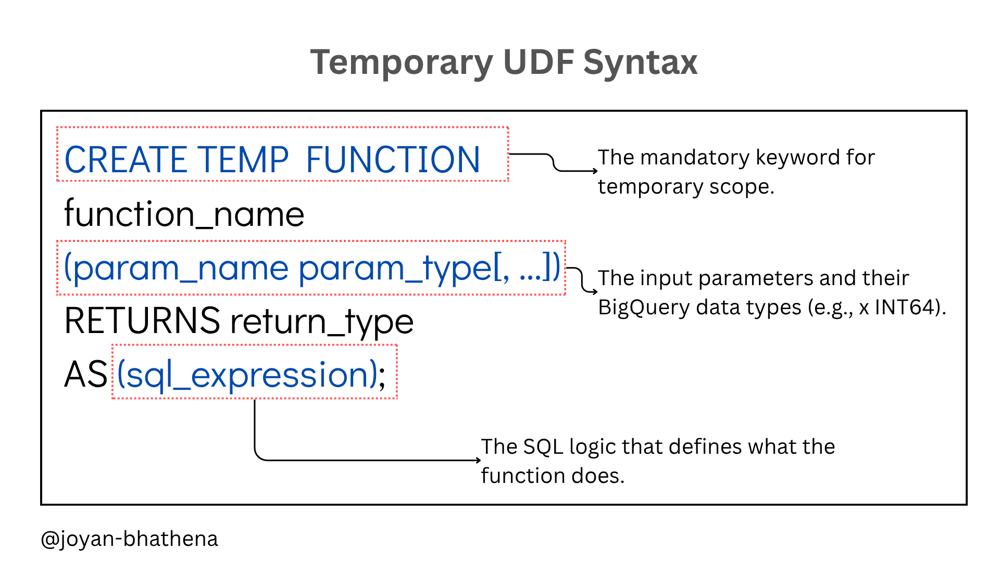
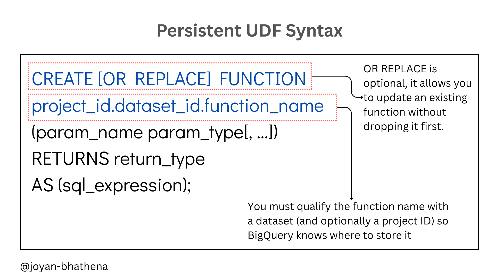

# User-defined Functions in BigQuery - GA4 Use Cases

If you've worked with GA4 data in BigQuery, you've probably written the same UNNEST statement more times than you can count. That's just the nature of GA4's nested schema — event parameters, user properties, items — they're all stored as repeated records, and every query needs to unpack them before you can do anything useful. UDFs won't remove that complexity, but they can hide it, so you write it once and call it anywhere. This article walks through what UDFs are, when they're worth reaching for, and most importantly how they apply specifically to GA4 data in BigQuery.


---

## 1. What are UDFs
- UDFs provide users a way to create their own functions that they can use to reduce repetitive work. Think about it, how many times do you need to use the UNNEST event params statement to work with GA4 - wouldn't it be easier to have a function reduce that work.

- At the time of writing this, we have 3 options of creating UDFs in BigQuery [1]:
1. SQL
2. JavaScript
3. Python

For the sake of this article, we will focus on SQL-based UDFs.

- There are two types of UDFs based on the reusability
1. Temporary UDFs only exist within the scope of the query where it's defined
2. Persistent UDFs can be used across multiple queries


## 2. When to use UDFs 
So when should you consider using an UDF, here are some scenarios [2]:

1. When you have a lengthy statement that's used frequently

2. When the basic functions are not enough - for advanced use cases like looping through data

## 3. How to create UDFs in BigQuery

The syntax for BigQuery SQL User-Defined Functions (UDFs) depends on whether you want the function to be temporary (available only in the current session) or persistent (stored in a dataset for future use).

### 1. Temporary SQL UDF Syntax

Temporary functions are defined at the start of a query and exist only for the duration of that specific multi-statement query or session.



### 2. Persistent SQL UDF Syntax

Persistent functions are stored in a BigQuery dataset. They can be called from any query as long as the user has the appropriate permissions.




### Key Syntax Differences

| Feature | Temporary UDF | Persistent UDF |
| --- | --- | --- |
| **Keyword** | `CREATE TEMP FUNCTION` | `CREATE [OR REPLACE] FUNCTION` |
| **Naming** | Simple name (e.g., `my_func`) | Qualified name (e.g., `my_dataset.my_func`) |
| **Scope** | Current query session only | Permanent storage in a dataset |
| **Usage** | Best for one-off transformations | Best for shared logic across teams/projects |


## 4. GA4 UDFs

Before diving in, a quick recap on why GA4 queries tend to get verbose [3]. 

When GA4 exports data to BigQuery, event parameters and user properties aren't stored as flat columns — they're stored as arrays of key-value STRUCT pairs. So to get something as simple as the `page_location` value, you have to UNNEST the `event_params` array and filter by key. Every single time. That's exactly the kind of repetitive pattern UDFs are built for.

Here are three UDFs that will cover the majority of what you'll run into day-to-day.

---

### UDF 1 — Extract Any Event Parameter

This is the one you'll use most. The pattern of unnesting `event_params`, filtering by key, and then coalescing across `string_value`, `int_value`, and `float_value` comes up in almost every GA4 query. 

```sql
CREATE OR REPLACE FUNCTION `your_project.your_dataset.get_event_param`(
  event_params ARRAY<STRUCT<
    key STRING,
    value STRUCT<
      string_value STRING,
      int_value INT64,
      float_value FLOAT64,
      double_value FLOAT64
    >
  >>,
  param_key STRING
)
RETURNS STRING AS ((
  SELECT
    COALESCE(
      ep.value.string_value,
      CAST(ep.value.int_value AS STRING),
      CAST(ep.value.float_value AS STRING),
      CAST(ep.value.double_value AS STRING)
    )
  FROM UNNEST(event_params) AS ep
  WHERE ep.key = param_key
  LIMIT 1
));
```

**Usage**

Instead of writing the full UNNEST block every time:

```sql
-- Without UDF
SELECT
  event_name,
  (SELECT ep.value.string_value FROM UNNEST(event_params) ep WHERE ep.key = 'page_location' LIMIT 1) AS page_location,
  (SELECT ep.value.string_value FROM UNNEST(event_params) ep WHERE ep.key = 'page_referrer' LIMIT 1) AS page_referrer
FROM `your_project.analytics_XXXXXXXXX.events_*`

-- With UDF
SELECT
  event_name,
  `your_project.your_dataset.get_event_param`(event_params, 'page_location')  AS page_location,
  `your_project.your_dataset.get_event_param`(event_params, 'page_referrer')  AS page_referrer
FROM `your_project.analytics_XXXXXXXXX.events_*`
```

The savings here compound fast — once you're pulling 5 or 6 event params in a single query, the readability difference is significant.

---

### UDF 2 — Extract Session ID

`ga_session_id` is one of the most queried event parameters, and it's also a slightly special case because it's always stored as an `int_value`, not a string. Wrapping it in its own UDF keeps things clean and avoids the `CAST` showing up everywhere.

```sql
CREATE OR REPLACE FUNCTION `your_project.your_dataset.get_session_id`(
  event_params ARRAY<STRUCT<
    key STRING,
    value STRUCT<
      string_value STRING,
      int_value INT64,
      float_value FLOAT64,
      double_value FLOAT64
    >
  >>
)
RETURNS INT64 AS ((
  SELECT ep.value.int_value
  FROM UNNEST(event_params) AS ep
  WHERE ep.key = 'ga_session_id'
  LIMIT 1
));
```

**Usage**

A common pattern in GA4 BigQuery work is constructing a unique session key by combining `user_pseudo_id` and `ga_session_id`. With the UDF it's a lot less noisy:

```sql
SELECT
  user_pseudo_id,
  `your_project.your_dataset.get_session_id`(event_params) AS session_id,
  CONCAT(
    user_pseudo_id, 
    '_', 
    CAST(`your_project.your_dataset.get_session_id`(event_params) AS STRING)
  ) AS unique_session_key
FROM `your_project.analytics_XXXXXXXXX.events_*`
```

---

### UDF 3 — Strip Query Parameters from a URL

GA4 captures `page_location` as the full URL — query string and all. For most analyses (page-level traffic, funnel steps, content grouping), you want the clean path without `?utm_source=...` or `?ref=...` tagging along. This UDF handles it using BigQuery's native `REGEXP_EXTRACT`.

```sql
CREATE OR REPLACE FUNCTION `your_project.your_dataset.clean_page_path`(
  page_location STRING
)
RETURNS STRING AS (
  REGEXP_EXTRACT(page_location, r'^(?:https?://[^/]+)?(/[^?#]*)')
);
```

**Usage**

```sql
SELECT
  `your_project.your_dataset.get_event_param`(event_params, 'page_location') AS full_url,
  `your_project.your_dataset.clean_page_path`(
    `your_project.your_dataset.get_event_param`(event_params, 'page_location')
  ) AS clean_path
FROM `your_project.analytics_XXXXXXXXX.events_*`
WHERE event_name = 'page_view'
```

This also composes nicely with `get_event_param` — which is the real benefit of persistent UDFs. Once your team has a few of these defined in a shared dataset, queries start to look less like BigQuery boilerplate and more like actual business logic.

---

### When to make these persistent vs. temporary

For one-off exploratory queries, the temporary version is fine. But the real payoff of these GA4 UDFs comes when you make them persistent and store them in a shared dataset that your whole team can access. That way:

- Analysts aren't each writing their own version of the UNNEST pattern
- If the logic ever needs updating (e.g., handling a new parameter type), you fix it in one place

The `get_event_param` UDF in particular is worth making persistent immediately — it's universal enough that virtually every GA4 query benefits from it.

---

## Closing

UDFs are a great way to avoid repetitive code, especially when working with GA4 data in BigQuery. Investing an hour to set up a shared UDF library will pay off pretty quickly. Start with `get_event_param` - that alone will save you from rewriting the UNNEST block in every query you write. 

---

## References
- [1] Google Cloud Documentation — [BigQuery User-Defined Functions](https://cloud.google.com/bigquery/docs/user-defined-functions)
- [2] Alex Ignatenko — [How can UDFs simplify complex queries in BigQuery?](https://www.alexignatenko.com/post/how-can-udf-simplify-complex-queries-in-bigquery)
- [3] Google Analytics Help — [BigQuery Export Schema for GA4](https://support.google.com/analytics/answer/7029846)